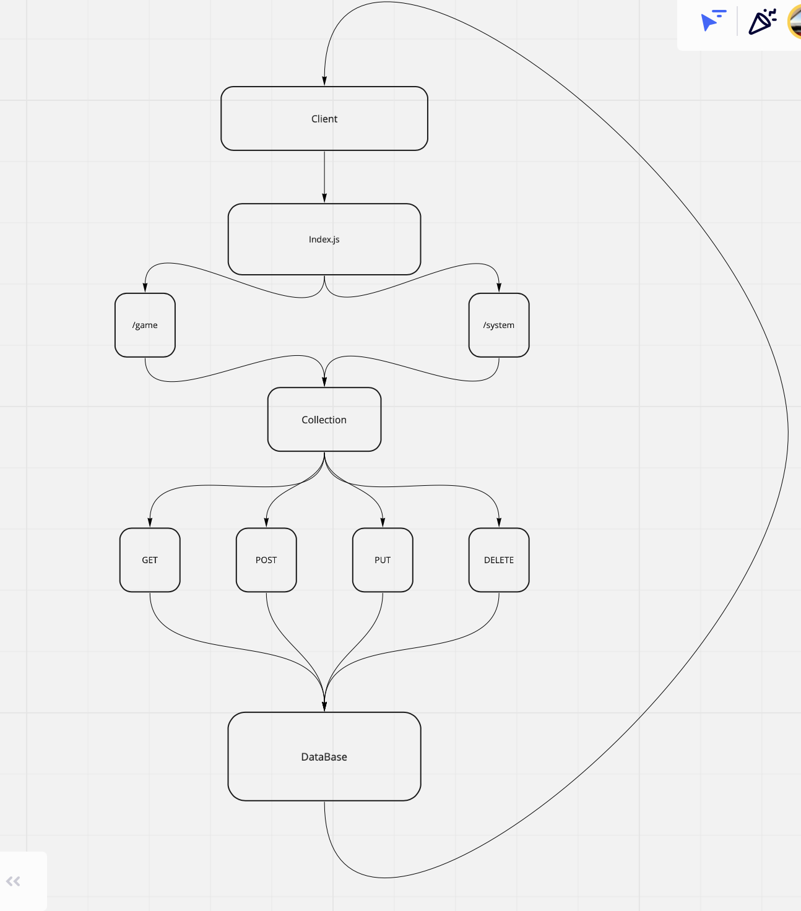

# api-server

This is a server template. The idea of this excercise is to have a fully functioning server that we can reference to get a server up and spinning quick and easily over the course of 401.

Express Server
Created by Jacob Gregor

## Installation\

npm install\
{
"dotenv": "^10.0.0",
"express": "^4.17.1",
"jest": "^27.3.1",
"nodemon": "^2.0.14",
"pg": "^8.7.1",
"sequelize": "^6.7.0",
"sqlite3": "^5.0.2",
"supertest": "^6.1.6"
}\

## Summary of Problem Domain\

lab-04: Created a Collection using our models for all of our CRUD requests.

SQL Models\
Create 2 SQL data models using the Sequelize libary, make sure you export those model instances.\
Make sure your Models are configured with your SQL dialect and can properly connect to your database.\
Your models should have appropriate field names declared with specific sequelize DataTypes.\

## Links to application deployment\

GET: https://basic-express-server-jake.herokuapp.com/person?name=jake

Heroku: https://basic-express-server-jake.herokuapp.com  
GitHub: https://github.com/Code-Fellows-401/basic-express-server

## Embedded UML\

WhiteBaord for Lab-04:
\

## Routes Used\

Path: /person?name=
responds with an { Object } with a key: value pair as follows -> {name: 'Name Here'}.\
HTTP GET

## Route: /system

Path: /system
responds with all { Object } with a key: value pair as follows -> {name: 'Name Here', city: 'Name Here'}.\
HTTP GET

Path: /system:id
responds with a specific { Object } based on the input Id with a key: value pair as follows -> {name: 'Name Here', city: 'Name Here'}.\
HTTP GET

Path: /system
Creates an specific { Object } based on the input model with a key: value pair as follows -> {name: 'Name Here', city: 'Name Here'}.\
HTTP POST

Path: /system:id
Updates a specific { Object } based on the id reference and the input model with a key: value pair as follows -> {name: 'Name Here', city: 'Name Here'}.\
HTTP PUT

Path: /system:id
Deletes a specific { Object } based on the id reference.\
HTTP DELETE

## Route: /game

Path: /game
responds with all { Object } with a key: value pair as follows -> {name: 'Name Here', position: 'Name Here'}.\
HTTP GET

Path: /game:id
responds with a specific { Object } based on the input Id with a key: value pair as follows -> {name: 'Name Here', position: 'Name Here'}.\
HTTP GET

Path: /game
Creates an specific { Object } based on the input model with a key: value pair as follows -> {name: 'Name Here', position: 'Name Here'}.\
HTTP POST

Path: /game:id
Updates a specific { Object } based on the id reference and the input model with a key: value pair as follows -> {name: 'Name Here', position: 'Name Here'}.\
HTTP PUT

Path: /game:id
Deletes a specific { Object } based on the id reference.\
HTTP DELETE
